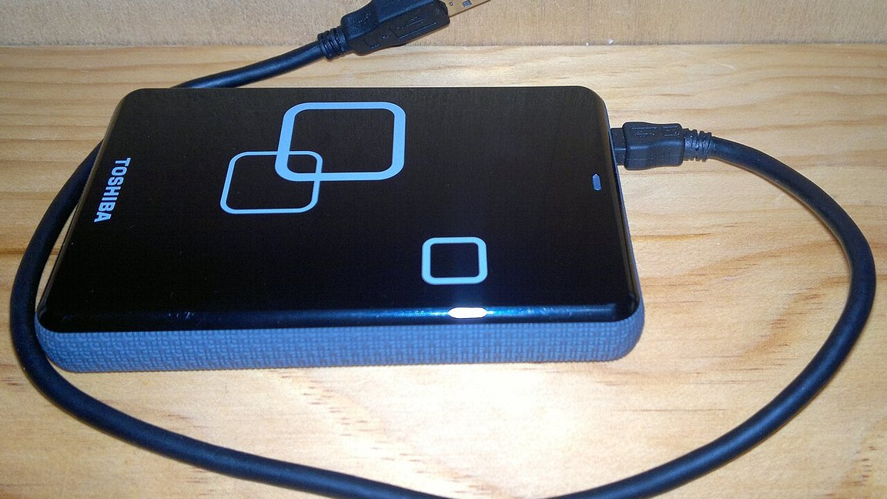

备份是一件很奇怪的工作：做对了没有任何反馈，没做却可能一次损失掉几年的东西。

我以前属于"记得就备份"的那一派——偶尔想起来，插上移动硬盘，把重要的目录拖过去。直到真的一次需要找回旧文件，才发现上一次备份已经是很久以前。

*题图来自 Wikimedia Commons，摄影 Editor182（公有领域）*

## 为什么"记得就做"注定失败

因为这件事的成本和收益在时间上是错开的。

成本发生在现在：要插硬盘、要等它拷完、要占一块桌面。收益发生在未来，而且大概率不会发生——**绝大多数备份，终其一生都没有被用上。**

人对这种交易天生不敏感。所以"记得就备份"的结果，通常是一直没想起来。

## 让它不依赖记性

后来我把这件事收成三条规则，核心是同一件事：**不要让触发条件落在我身上。**

- 重要的目录放进同步盘，改动即上传，不需要我动手；
- 每周一次全量快照，由计划任务在夜里跑，跑完才通知我；
- 移动硬盘常年插在机器上，而不是收进抽屉——收起来的东西等于不存在。

第三条听起来最不重要，实际影响最大。**任何需要"先去找出来"的流程，都会在最忙的时候被跳过。**

## 备份过，不等于能恢复

还有一个更隐蔽的问题：备份文件在，不代表它可用。

压缩包可能损坏、目录可能被排除规则漏掉、权限可能没带上。这些在真正恢复之前都看不出来。

所以我现在会定期做一次很小的恢复演练：随便挑一个文件，从备份里真的还原一次，看看能不能打开。**没验证过的备份，只能算"我以为备份了"。**

## 写在最后

备份是少数几件"做好了也看不出好"的事情之一。它不产生功能，不改善体验，平时完全沉默——只在最糟的那一天起作用。

正因为如此，它不该依赖任何一次"想起来"。

> 一个只在出事那天被检验的习惯，必须做成不用思考的默认动作。
